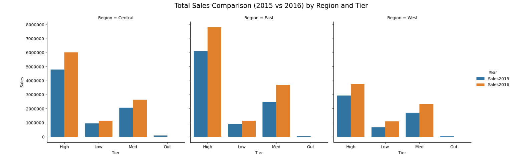
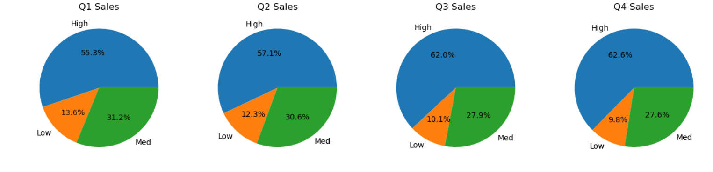
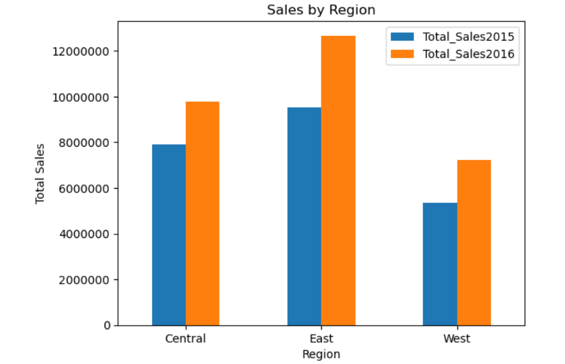

# 📊 Python Visualizations Case Study

This project explores sales performance data using Python’s data visualization libraries such as **Matplotlib** and **Seaborn**. It demonstrates how visual storytelling can help uncover business trends and actionable insights from raw data.

---

## 🗂️ Project Structure

```
📁 Python-Visualizations
├── 📄 Data visualization case study.ipynb
├── 📊 SalesData.csv
├── 📄 README.md
├── 📄 requirements.txt

```

---

## 🚀 How to Run This Project

1. **Clone or Download** this repository.
2. Make sure Python and Jupyter are installed. Then install dependencies:
   ```bash
   pip install -r requirements.txt
---

## 📊 Key Visualizations Created
- 📈 Monthly Sales Trends  
- 📉 Sales by Region  
- 🛍️ Top-Selling Products  
- 🧍‍♂️ Customer Purchase Behavior  
- 💰 Category-Wise Revenue Contribution  

> 🖼️ Visual outputs are saved in the `outputs/` folder for easy access and embedding.

---

## 🧠 Key Insights
- 📆 Seasonal trends show peak sales during holidays and end-of-year.  
- 💼 Electronics and Fashion consistently drive the highest revenue.  
- 🗺️ Western and Southern regions dominate in terms of sales volume.  
- 🧮 Visualization helps identify underperforming products and locations for improvement.  

---

## 📌 Business Impact
- 🧭 Reveals regions that need targeted promotions and campaigns.  
- 🎯 Assists inventory teams in stocking high-demand products.  
- 💡 Equips decision-makers with visual dashboards for strategy planning.  

---

## 🛠️ Tools & Technologies Used
- Python 🐍  
- Pandas 🐼  
- Matplotlib 📉  
- Seaborn 🌊  
- Jupyter Notebook 📓

  ---

  ## 📸 outputs visuals

To include visual proof of your results, save a screenshot and place it in an `outputs/` folder:








## 📌 Author

**Abhishek Bhardwaj** 
  
[LinkedIn](https://www.linkedin.com/in/abhishekbhardwaj28)
[GitHub](https://github.com/abhishek-9617)
